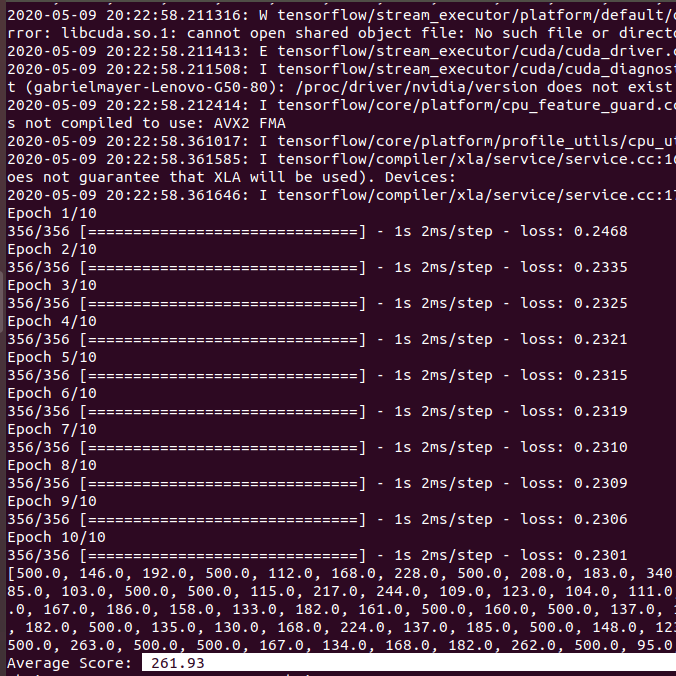
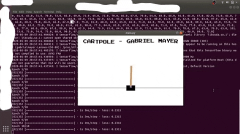

# cartpole-RL

This's a simple project using Reinforcement Learning to play CartPole-v1, from OpenAi gym. 😎

I really recommend use a **virtual environment** to install all the requisites and run this project.

## Requisites:

* Python 2.7.17 or Higher
* OpenAI gym
* Tensorflow 2.0 or Higher

## Running

To run the project, use `python main.py`

## Results

In this challenge, I got a Average Score of 261.93!

## Playing like a Semi-Pro ;)

